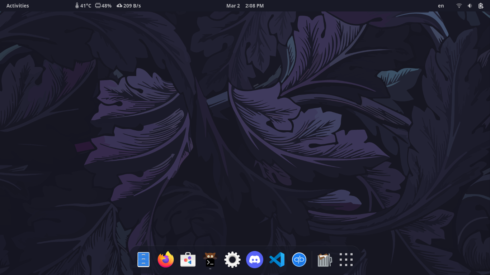
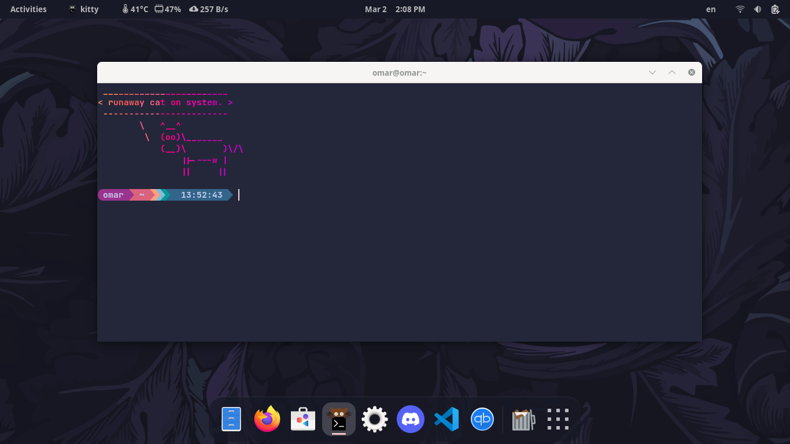

# Fedora Linux

## It's History
To begin with, Fedora Linux or Fedora for short is **based on** [Red Hat Linux](https://en.wikipedia.org/wiki/Red_Hat_Linux)

Warren Togami began Fedora Linux as an undergraduate project at the University of Hawaii, the key difference between **Fedora Linux** and **Red Hat Linux** was that Fedora's repository development would be collaborative with the global volunteer community.

 Fedora Linux, then known as "Fedora Core" was a fork of Red Hat Linux launched in 2003, bascially [Red Hat](https://en.wikipedia.org/wiki/Red_Hat) were trying to be innovative and stable at the same time with **Red Hat Linux**, and as we all know innovation and stabillity don't go very well hand-in-hand, so as expected this wasn't working well for them or their users, which at the time were mainly enterprise companies, so they decided to discontinue **Red Hat Linux** so the team can focus on their **paid + stable** version for servers [Red Hat Enterprise Linux](https://en.wikipedia.org/wiki/Red_Hat_Enterprise_Linux) and for it to be **Red Hat's** only officially supported linux distribution, while **Fedora** was to be a community distribution **(free + full of innovation)**.

## Distro images

## It's Pros
- It's 100% free of charge, unlike something like Red Hat Enterprise Linux that we mentioned before.
- It's simple and beginner friendly and doesn't require a long time to get the hang of it.
- It's less hardware demanding, using only 1 GB of RAM while idling.
- In general Fedora is a great OS out of the box with a user friendly UI and a great community.

## It's Cons
- It relatively requires a long time to set up.
- Instability, since as we talked before, Fedora is quite new and always has the latest features, and that as we know generates instability, so that's the price you pay for always having the latest features.

## Who is it made for?
Fedora is targeted at the average user that isn't necessarily tech-savvy however, It can still be used by more advanced linux users.
## Who is it **not** made for?
Fedora is not made for someone who isn't patient, meaning that he doesn't have the patience to for example move his OS a minimum of about once a year, or who wants a stable OS and doesn't really care that much about having the very latest features.

## What desktop environment does it use?
- Fedora by defualt uses GNOME DE but you can install other DEs manually later.

## What package manager does it use?
- Fedora uses the RPM Package Manager (formerly RedHat Package Manager).
## User Experiences/Reviews
**Jane Alam T. ~ A Fedora linux user:**

**"Everybody can enjoy the benefits of it."**

**Overall:** It has revolutionized how I do my work and has been a true lifesaver for me.

I've been a Fedora Workstation user for the past few years and I love it. It's a perfect balance of power, flexibility, and more. It's easy to use out of the box and you can configure it to be as simple or as advanced as you want. In my opinion, this is the best Linux distro available today.

You can view more reviews [here](https://www.capterra.com/p/229028/Fedora-Workstation/reviews/#:~:text=Pros%3A%20I've%20been%20a,best%20Linux%20distro%20available%20today.).
## Fun facts
- Fedora Linux is ranked currently as the 7th best Linux distro on [Distrowatch](https://distrowatch.com/dwres.php?resource=popularity).
- Linus Torvalds himself is widely believed to be using Fedora Linux for him and his family.
## How to install it?
1. You can get Fedora's ISO image [here](https://getfedora.org/en/workstation/download/).

2. You can then burn the ISO image to a USB stick using [Balena Etcher](https://www.balena.io/etcher) or [Rufus](https://rufus.ie/en/).

3. After creating bootable usb stick, Restart your device and boot into USB stick.

4. You can try out fedora before installing it on your hard drive.

5. If you like the look and feel, you can choose "Install to hard drive" option.

6. You will be prompted to select your timezone and keyboard layout.

7. Click continue then you will be prompted with this screen, Click on installation destination.

8. Choose the hard drive that you want Fedora to be installed on, once finished, Click done.

9. You will be redirected to screen mentioned in step 7, Click begin installation and wait for it to finsh.

10. Reboot your device and remove USB stick.

11. You will then be prompted with this screen to continue setting up your user info and to edit privacy and enable third party repositories.

**12. Enjoy using Fedora !**

