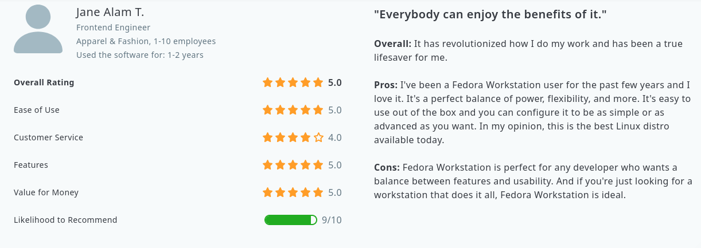

# Fedora Linux

 

## It's History
To begin with, Fedora Linux or Fedora for short is **based on** [Red Hat Linux](https://en.wikipedia.org/wiki/Red_Hat_Linux)

Warren Togami began Fedora Linux as an undergraduate project at the University of Hawaii, the key difference between **Fedora Linux** and **Red Hat Linux** was that Fedora's repository development would be collaborative with the global volunteer community.

 Fedora Linux, then known as "Fedora Core" was a fork of Red Hat Linux launched in 2003, bascially [Red Hat](https://en.wikipedia.org/wiki/Red_Hat) were trying to be innovative and stable at the same time with **Red Hat Linux**, and as we all know innovation and stabillity don't go very well hand-in-hand, so as expected this wasn't working well for them or their users, which at the time were mainly enterprise companies, so they decided to discontinue **Red Hat Linux** so the team can focus on their **paid + stable** version for servers [Red Hat Enterprise Linux](https://en.wikipedia.org/wiki/Red_Hat_Enterprise_Linux) and for it to be **Red Hat's** only officially supported linux distribution, while **Fedora** was to be a community distribution **(free + full of innovation)**.

## Distro images
``-> Add distro images``

## It's Pros
- It's 100% free of charge.
- It's simple and beginner friendly and doesn't require a long time to get the hang of it.
- It's less hardware demanding using only 1 GB of RAM while idling.
- In general Fedora is a great OS out of the box with a user friendly UI and a great community.

``(Stability , Security , Performance , Compatible apps , Hardware/System requirements, Technical support of the distro's maintainers) and any other points you find``
## It's Cons
``-> Add distro cons relating to: ``

``(Stability , Security , Performance , Compatible apps , Hardware/System requirements, Technical support of the distro's maintainers) and any other points you find``

## Who is it made for?
Fedora is targeted at the average user that isn't necessarily tech-savvy however, It can still be used by more advanced linux users.
## Who is it **not** made for?
``-> Add types of users that **wont** find this distro suitable``

## What desktop environment does it use?
- Fedora by defualt uses GNOME DE but you can install other DEs manually later.

## What package manager does it use?
``-> Add the package manager that it uses (apt, rpm, dpkg, etc)``
## User Experiences/Reviews

You can view more reviews [here](https://www.capterra.com/p/229028/Fedora-Workstation/reviews/#:~:text=Pros%3A%20I've%20been%20a,best%20Linux%20distro%20available%20today.).
## Fun facts
``-> Add some fun facts about the distro like (Famous people who use the distro and Distrowatch ranking) ``
## How to install it?
- You can get Fedora's ISO image [here](https://getfedora.org/en/workstation/download/).
- You can then burn the ISO image to a USB stick using [Balena Etcher](https://www.balena.io/etcher) or [Rufus](https://rufus.ie/en/).
- After creating bootable usb stick, Restart your device and boot into USB stick
- You can try out fedora before installing it on you hard drive.
- If you like the look and feel you can choose "Install to hard drive" options.
- You will be prompted to select your timezone and keyboard layout, After you do so click install and wait for it to finish installation.
- After it finishes, Reboot your device and remove USB stick you will then be prompted to make a user follow the instructions till the end0
- Enjoy using Fedora!

