# Kali

## What Kali based on ?

- ### Kali is based on Debian.
---
## Kali History

- ### The first Kali Linux project was originally called Whoppix, also referred to as WhiteHat Knoppix. As the name suggests, it was based on Knoppix. 

- ### Knoppix is an operating system based on Debian designed to be run directly from a CD / DVD or a USB flash drive.

- ### Kali Linux was officially released in 2013.
---
## pros

- ### More than 600 penetration tools included (make it easier for network security teams to assess the security of their networks)
- ### Multiple language support
- ### Completely customizable (allows us to customise and alter Kali Linux ISO images)
- ### Free (Will always be free)
- ### Wide-ranging device support (connect to a variety of USB and other wireless devices)
- ### Open development tree (anyone can inspect the codes and gain easy access to the system / keep track of the coding at each stage)
- ### Adherence to File-system Hierarchy Standard(Simply type the tool's command name into the root terminal in Kali Linux)
- ### Open source and has a good platform support
---
## cons
- ### A little bit slow
- ### A few softwares may malfunction
- ###  is not advised for individuals who are new to Linux and wish to learn the operating system (Penetration Oriented / lacks a graphical user interface"GUI")
- ### Some tools that is available in other distros such as Ubuntu or Fedora are not available in kali
- ###  Inadequate for all Hardware and Has Bugs and Security Vulnerabilities

---
## Who's it made for?

- ### Kali is a Linux distribution specifically geared towards professional penetration testers and security specialists, and given its unique nature.

---
## Who's not it made for?
- ### It is NOT a recommended distribution if you’re unfamiliar with Linux or are looking for a general-purpose Linux desktop distribution for development, web design, gaming, etc.

---
- ## How to install Kali
    - Frist we need to download virtualBox klick
     [here](https://www.virtualbox.org/) to install it.
    - and dowenload the Kali.iso from [here](https://www.kali.org/get-kali/#kali-platforms).
    - Upon starting up VirtualBox, select **"New"**.
  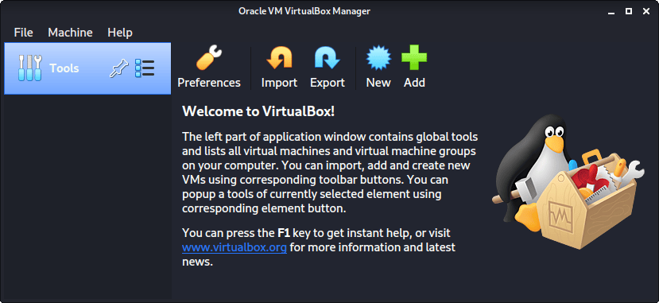

    - The next screen is “Name and operating system” which is where you name the VM. This name is also used in any filenames.
     and press <kbd>Next</kbd>
  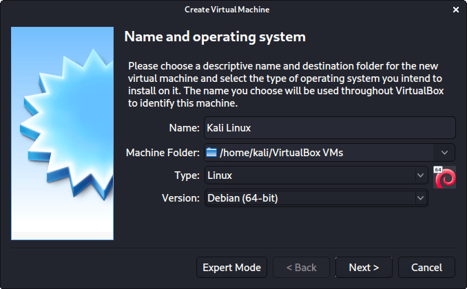

    - "Memory size" is the next section, where we can define how much RAM to use. the higher the amount of RAM, the more applications can be open and at increased performance. Various tools inside of Kali can be demanding of resources. When we make the general VMs, we select 2048 MB (2GB) for RAM.
    and press <kbd>Next</kbd>
  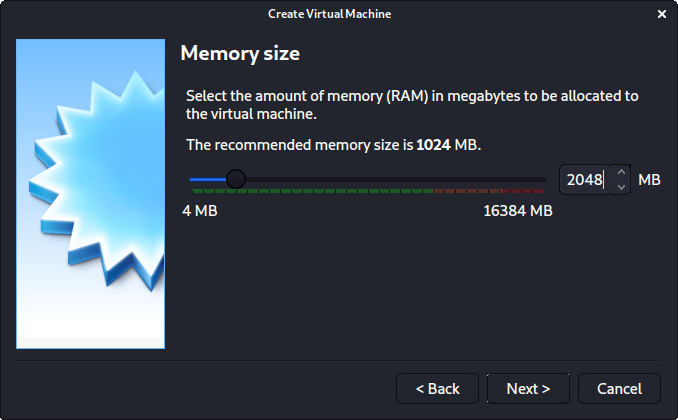

    - This screen below, "Hard disk", allows us to **Create a new virtual disk now**.
    and press <kbd>Create</kbd>
  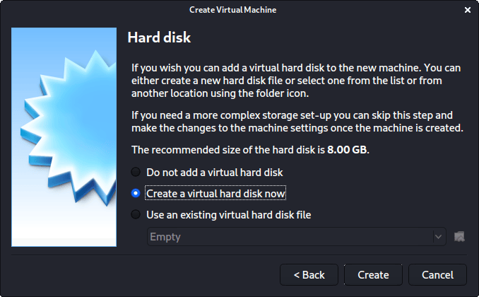

    - For the **Hard disk file type**, we select VDI (VirtualBox Disk Image) (and its the default option).
    and press <kbd>Next</kbd>
  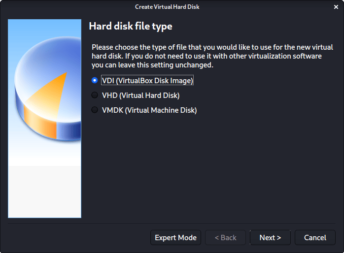

    - For the following screen, "Storage on physical hard disk", we go with the default option of **Dynamically allocated**.
    and press <kbd>Next</kbd>
  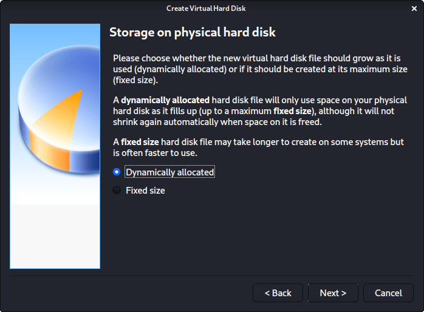

     - Now with "File location and size", we can now define how large the virtual hard disk will be. We use 80.00 GB (Option).
     you can use less.
     and press <kbd>Create</kbd>
  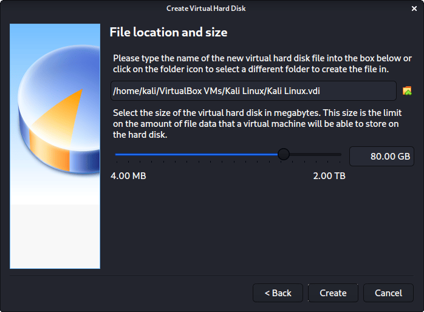

     - After clicking on "Create", the wizard is complete.
        Now we click on <kbd>Settings</kbd>, to customize the VM further.
  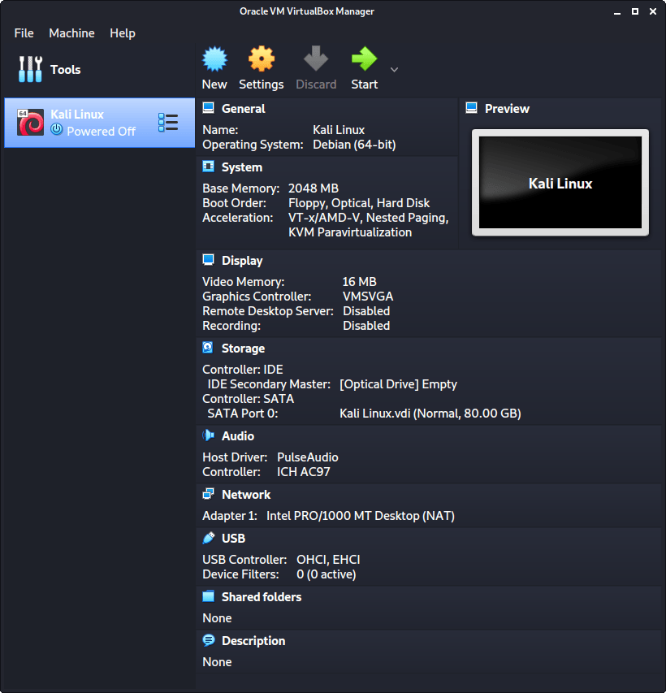

    - In General -> "Advanced", we make sure to set **Shared      Clipboard** to **bidirectional**, as well as **Drag’n’Drop** to **bidirectional**
  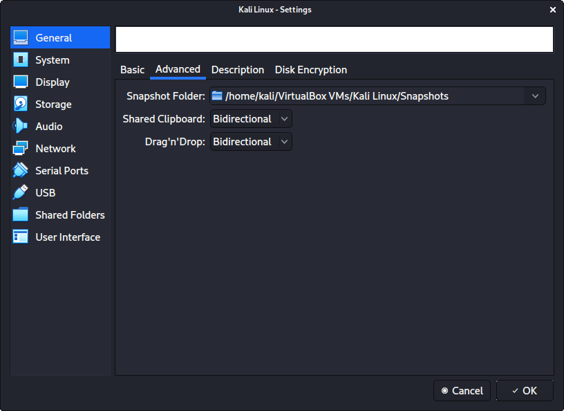

    - In **System** -> "Motherboard", we change the **Boot Order** to make sure Hard Disk is top and Optical is the second.
  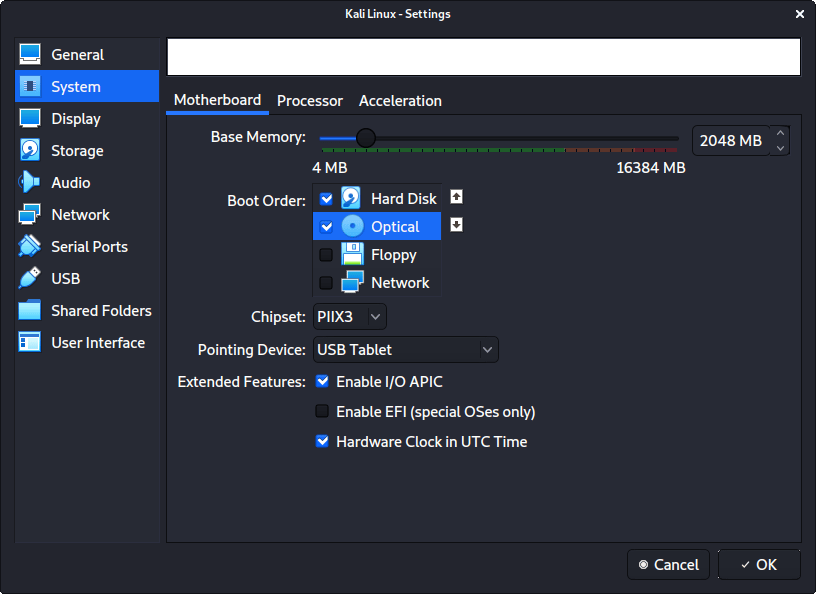

    - In **System** -> **Processor**, we increase the “Processor(s)” to be **2**.
    At the same time, we also **enable** “Extended Features” for Enable PAE/NX.
  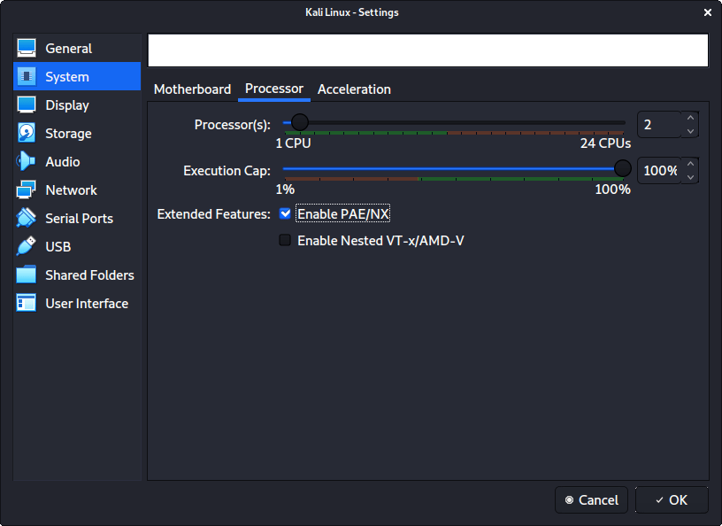

    - In **"Display"** -> **"Screen"**, we make sure to have “Video Memory” set to 128 MB
    Another item to point out is to make sure that **“Accelerated 3D graphics” is disabled**, as people have reported that causes issues.
    and press <kbd>OK</kbd>
  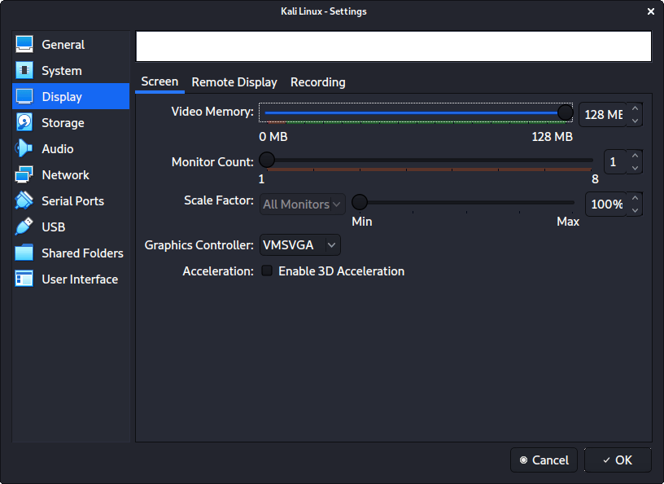

    - The final settings view looks like the following:
      and press <kbd>Start</kbd>
  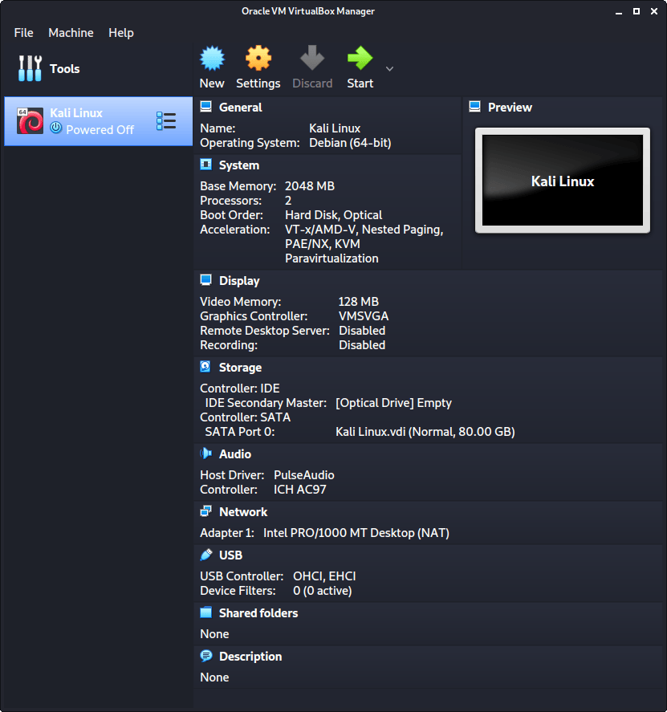

    - The first time we run it, we will get a prompt saying do we wish to mount an image to use as a “start-up disk”. We want to use our Kali image, rather than a physical drive, so we select the icon to the side of the drop down.
  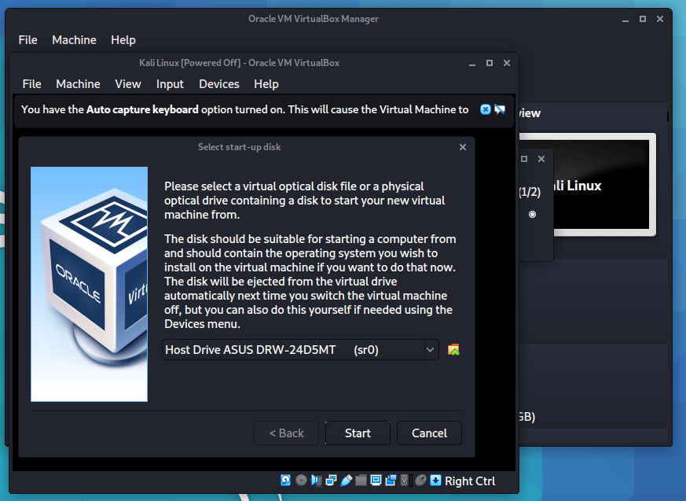
    - A new pop up will open, “Optical Disk Selector”. We will now press <kbd>Add</kbd> , then navigate to where our ISO is located.
  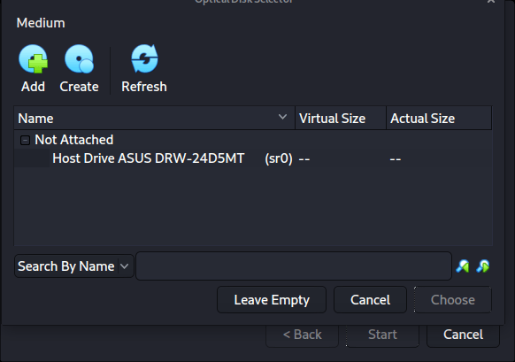

    - After pressing “Open”, we can see its been added, so we make sure its selected and press press <kbd>choose</kbd> .
  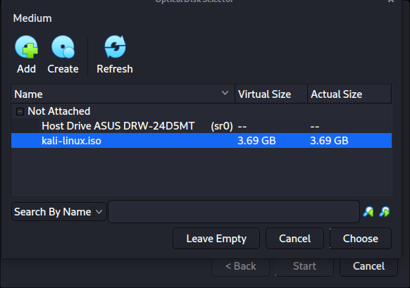

    - All that is left now to do is press <kbd>Start</kbd> .
  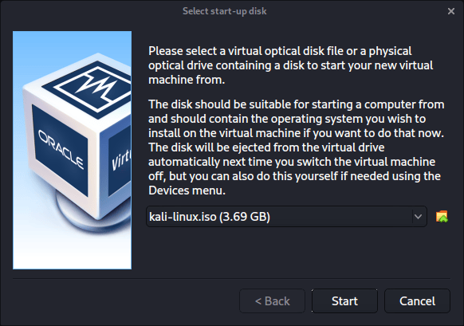

    - and here it is:
  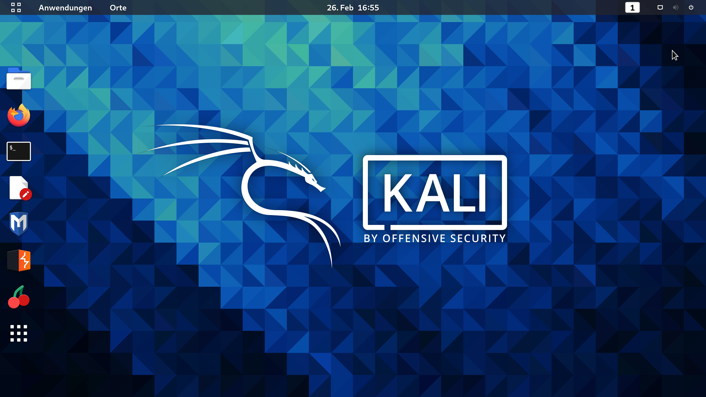

---