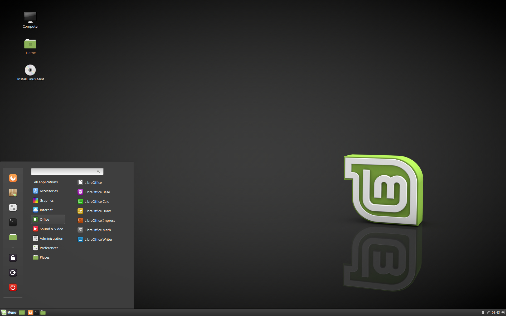
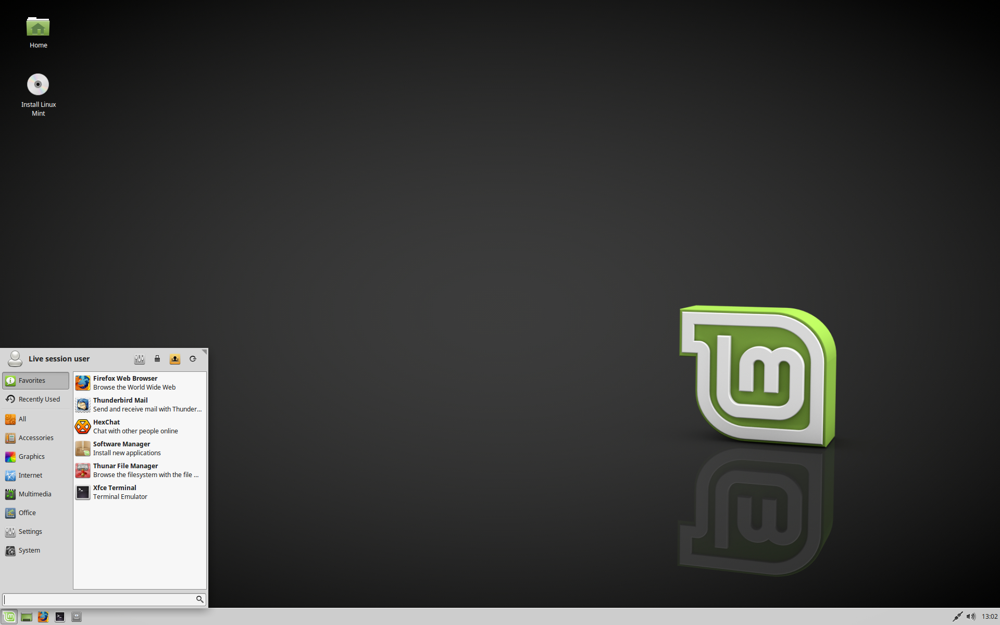

# Linux Mint

## It's History

Linux mint is a distribution based on [**Ubuntu**](https://ubuntu.com/) (which in turn is based on [**Debian**](https://www.debian.org/)).

The Linux mint project was started by a software developer called Clément Lefèbvre (now known as Clem). 

Clem at the time was writing reviews and tutorials for various Linux websites and decided to start his own Linux blog which he called "Linux mint" (Yes that's where the name came from).

While writing his content, Clem started gaining an understanding of what the community wants from a distro and so he started the Linux mint project in 2006, and it is now one of the most popular distros out there. 

**Why Mint was made?**

Because the base distro (in this case Ubuntu) had some problems and so the linux mint team aimed to fix these issues in their distro. 

They also created this distro to better suite people with needs that Ubuntu didn't address. Aditionally, the team added some new packages (which is always nice to have).
#### Problems Like : 
1 - Stability, Ubuntu’s frequent major changes are a double-edged sword, tending to push users towards alternatives like Linux Mint.

2 - Lack of stable release schedule, which means that if you’re looking for long-term support or bug fixes, then you'll have to pay extra and wait longer than usual.

3 - Non-LTS (or interim) versions only include nine months of security support. If you run an older version of Ubuntu and need support from Canonical. Then, you have to upgrade all your packages or wait until an LTS version is released.

## It's Pros
- Works out of the box with full multimedia support (requires very little effort to set up).
- Very stable and low maintenance.
- It's based on Ubuntu which gives the user a large number of available packages (around 30,000).
- It's a very beginner-friendly distro.
- Provides great stability with software packages and balances that with a hardware enablement stack to give newer computers a fighting chance at working with Linux.
- Mint is the best choice for low and minimum requirements Hardware/System as all it needs to run is 2 GB of RAM, 20 GB of hard drive space, and  1024 x 768 resolution.
- Beautiful Desktop
- Drivers, Multimedia, and Tools Support
- An Open-Source Philosophy
- A Welcoming Community

For extra knowledge you can find details [here](https://www.fossmint.com/reasons-to-use-linux-mint/)

## It's Cons
|          Related TO          |                                                                                                                   Cons                                                                                                                    |
|:----------------------------:|:-----------------------------------------------------------------------------------------------------------------------------------------------------------------------------------------------------------------------------------------:|
|           Security           |                                                        The Linux Mint project does not provide security advice and has been criticized for not doing so on at least one occasion.                                                         |
|       Compatible apps        |                                                  Some of the most popular Windows apps are not compatible with mint, however, they can be emulated using [Wine](https://www.winehq.org/).                                                  |
|Supporting Technology|Mint has a conservative approach to new technologies. So, if you like to keep up with the latest technologies or flashy desktops, then you may be better suited to a distro such as Fedora instead.|
|Device Manager|No joint accounts.|

## Who is it made for?
Mint's target user is someone who comes from a windows background.

## Who is it **not** made for?
This distro is not made for people who want bleeding-edge performance out of their machine or people who are looking for a distro that allows them to have fine-grain control over every single detail in order to fully customize their operating system. 

People who fall in either or both of the above categories usually find other distros such as Arch Linux more suitable for their needs.

## What desktop environment does it use?

**Mint GNOME**

One of the nice things about Linux mint is that it comes in **three Editions**, each with a different desktop environment to suit different needs.

**The editions are Cinnamon, MATE, and Xfce.**

**Cinnamon**

Cinnamon is a desktop environment developed by the Linux mint team and is based on the GNOME 3 desktop environment.

Cinnamon is the most modern and feature rich desktop envrionemnt and also the one that requires the most computing resources.

**MATE**

Another version of linux mint uses the MATE desktop environment which is also developed by the linux mint team and is based on the GNOME 2 desktop enviornment.

The mate version has a slower development and has less features than the cinnamon edition, however, it is less resource intensive than cinnamon.

**Xfce**

The last version of linux mint uses the Xfce desktop environment.

The Xfce version does not have as many features as in the cinnamon and MATE versions but it is extremely stable and very light on resource usage making it optimal for low spec machines.

## What package manager does it use?

Linux Mint uses the apt package manager. 

## User Experiences/Reviews
- I really love Linux Mint, it is easy to install, and very easy to use - yet it also has all the power of Linux under its hood. Just open up a terminal and everything is there. A well thought and well-rounded desktop-focused distribution with some really stunning aesthetics.
- Linux Mint is a great alternative for Windows or Ubuntu users, who are looking for a free and genuine operating system, that is both reliable and easy to operate.
- The main features of Linux Mint that made me choose it were: tools for graphic design (GIMP, Blender, and Inkscape), improved productivity with LibreOffice suite, and access to more than 7 thousand games with Steam.
## For your knowledge
Linux mint is ranked currently as the 2nd best Linux distro on [Distrowatch](https://distrowatch.com/index.php?dataspan=26)

## How to install it?

You can go through it following this site [How to Install Linux Mint 20 [The Simplest Way Possible]](https://itsfoss.com/install-linux-mint/)

### Step 1: Download Linux Mint ISO

### Step 2: Create a live USB of Linux Mint

### Step 3: Boot from the live Linux Mint USB

### Step 4: Install Linux Mint

### Step 4: Click on iso Icon

###  Step 5: Choose some basic configurations like language and keyboard layout

###  Step 6: Choose Partition [Be carefull]

The next screen is the most important part of the Linux Mint installation. You are going to format the entire hard disk and install Linux Mint. Linux Mint will be the only operating system on your computer.

Again, this means that you’ll lose all the data on the disk. Please copy important files to an external disk.

In this method, Linux Mint handles everything on its own. It creates an ESP partition for EFI boot manager of about 500 MB and the rest of the disk is allocated to the root partition. The root consists of a swapfile for swap usage and your home directory. This is the easiest setup with no extra effort.
You’ll be warned that the disk will be formatted. Hit continue and you’ll have to select the timezone in the next. You may change it later as well.

###  Step 7: Select timezone 

###  Step 8: Set username and password

###  Step 9: **Enjoy !!**

# After Installation

***[Highly recommended]*** watch the next video 
[15 Things To Do First in Linux Mint](https://youtu.be/RXV6FXVL6xI)
 to not face any difficulties while using Linux in the future and have a great 
*User Experience*

 
