# Parrot
- ## What's it based on?
    Parrot Os is a Linux distribution based on Debian with a focus on security,privacy,and development
- ## History of Parrot Os
    - ### What is the ParrotOs?
        ParrotOs is a free and open-source GNU/Linux distribution that is based on Debian stable and designed for security experts , computer forensics,reverse engineering, hacking , penetration testing , anonymity,privacy, and cryptography.Frozenbox develops it and comes with MATE as the default desktop environment. it has a complete portable arsenal for IT security and digital forensics activities .it also include everything you will need to create apps or protect your online privacy.ParrotOs is available in three editions:(Security,Home,Architect Editions) even as a virtual machine for the Raspberry Pi and Docker. the support for ARM systems(arm64 and armhf) has been restored in version 5.0 LTS, and certain images are now available for board such as the Raspberry Pi . the operating systems comes with MATE Desktop environment by default. however,alternative DEs can be installed .

    - ### What is the History of ParrotOs?
        Parrot Security Os is developed by security expert Lorenzo Faletra a long with a team of other security experts , open source developers ,digital rights advocates,and other linux enthusiasts.the first bublic release was on April 2013.version 1.0 codenamed Hydrogen was released in july 2014. Version 2.0 codenamed Helium came out in september 2015. version 3 codenamed Lithium came out in june 2016. version 4 was released in may 2018.ParrotOs is currently at version 4.11 released last march 2021.

        As mentioned, Parrot is based on debian though the Parrot team considered shifting to Devuan in 2017 due to problems with system,but was eventually resolved .in january 2019, the team has phased out 32-bit support to concentrate their effort s on x64 and ARM. and to ensure the systems becomes further lightweight,the XFCE Desktop environment (home edition only) became officially supported in August 2020.

- ## Pros & Cons
  Parrot OS is a popular Linux distribution that is focused on security, privacy, and development. Like any operating system, Parrot OS has its pros and cons, which we'll discuss below:
  - ### Pros:
    - Security: Parrot OS has several built-in security features, such as a sandbox system, cryptography tools, and anonymous browsing tools.
    - Privacy: Parrot OS is designed to protect users' privacy by providing secure and anonymous browsing, as well as encrypted communication channels.
    - Wide range of tools: Parrot OS includes a vast array of pre-installed tools for penetration testing, cryptography, and digital forensics.
    - Lightweight: Parrot OS is designed to be lightweight, making it ideal for running on older hardware.
    - Easy to use: Parrot OS has a user-friendly interface and is easy to install and configure, making it a great choice for beginners.
    - Versatile: Parrot OS is versatile and can be used for a variety of purposes, including penetration testing, digital forensics, cryptography, and development.
    - Free and open-source: Parrot OS is free and open-source software, which means anyone can download, use, and modify it as per their needs.
    - Active community: Parrot OS has an active community of developers and users who contribute to the development of the OS, provide support, and share knowledge and resources.
    - Updated regularly: Parrot OS is regularly updated with the latest security patches and software updates, ensuring that users have access to the latest tools and features.
    - High level of customization: Parrot OS is highly customizable, allowing users to configure and tweak various aspects of the OS to meet their specific needs.
    - Open source: Parrot OS is an open-source operating system, which means that the source code is freely available to anyone, and users can modify and redistribute it.
    - Regular updates: Parrot OS is regularly updated with new features and security patches to ensure that users have the latest tools and security measures.
    - Customizability: Parrot OS is highly customizable, allowing users to install additional software and configure the system to suit their needs.
    - Portable: Parrot OS can be installed on a USB drive, making it easy to carry around and use on any computer.
    - Community support: Parrot OS has a supportive community of users and developers who provide assistance and share knowledge through forums, blogs, and other channels.
---
  - ### Cons:
    - Limited mainstream support: While Parrot OS has a supportive community, it may not have the same level of mainstream support as some other popular Linux distributions.
    - Not ideal for everyday use: Parrot OS is primarily designed for security and development purposes, which means it may not be the best option for everyday use.
    - Learning curve: Some of the tools in Parrot OS may have a steep learning curve, which may require some effort to master.
    - Not suitable for gaming: Parrot OS is not designed for gaming, so it may not be the best choice for users who want to play games on their computer.
    - Overall, Parrot OS is an excellent choice for users who are looking for a secure, privacy-focused, and lightweight Linux distribution. However, it may not be the best option for users who need an operating system for everyday use or gaming.
    - Limited software support: Parrot OS is not as popular as some other Linux distributions, which means that it may not have as wide a range of software support.
    - Limited software availability: While Parrot OS has a vast collection of pre-installed tools, it may not have the same level of software availability as some other popular Linux distributions.
    - Hardware compatibility issues: Parrot OS may not work on all hardware configurations, which could be a problem for users with older or less common hardware.
    - Dependency issues: Installing and configuring some software in Parrot OS may require resolving dependency issues, which can be time-consuming and challenging for new users.
    - Documentation: While Parrot OS has comprehensive documentation, some users may find it challenging to understand or navigate, especially if they are new to Linux.
    - Resource-intensive: Some of the tools in Parrot OS are resource-intensive, which means that they may not run smoothly on older or less powerful hardware.
---
- ## Who is it for and Who is it not for?
    - #### Parrot OS is a Linux-based operating system that is designed for ethical hacking, pen testing, digital forensics, and cryptography. It is specifically targeted towards security researchers, penetration testers, network specialists, and other professionals who work with computer security.
        - Parrot OS comes pre-installed with a wide range of tools for network analysis, vulnerability assessment, and penetration testing. It also includes tools for digital forensics, reverse engineering, and cryptography, making it a versatile platform for cybersecurity professionals.
However, it should be noted that Parrot OS is not limited to these uses only and can be used by anyone who is interested in using a privacy-focused, secure, and open-source operating system.
    - #### Parrot OS is primarily designed for cybersecurity professionals, ethical hackers, and pen testers who need a powerful and versatile platform to carry out their work. As such, it may not be suitable for those who are looking for a more user-friendly and straightforward operating system.
        - Parrot OS requires some level of technical knowledge and expertise to use effectively, and it may not be suitable for beginners or casual users who are not familiar with Linux-based operating systems.
Additionally, Parrot OS is not designed for general-purpose computing tasks like web browsing, multimedia, and productivity applications. While it is possible to use Parrot OS for these purposes, it may not provide the same level of user experience as other more mainstream operating systems.
Finally, Parrot OS may not be suitable for individuals who do not require the advanced security and privacy features offered by the operating system. If you are simply looking for a basic operating system for everyday use, Parrot OS may not be the best choice.
   - ### ParrotOs is good for whom?
      + Parrot OS is an excellent choice for cybersecurity professionals, ethical hackers, and pen testers who require a powerful and versatile platform to carry out their work. It offers a range of tools for network analysis, vulnerability assessment, and penetration testing, making it an indispensable tool for these professionals.
      + In addition, Parrot OS is designed to provide strong privacy and security features, including built-in encryption and secure boot capabilities. This makes it a great choice for individuals who are concerned about protecting their data and maintaining their online privacy.
      + Parrot OS is also suitable for those who prefer open-source software and want to use an operating system that is free of charge and provides full access to its source code.
      + Finally, Parrot OS can be a good choice for those who enjoy customizing their operating system and prefer a more flexible and open approach to computing. Its lightweight and modular design allow users to tailor the system to their specific needs and preferences.
   - ### Parrot is not good for whom? 
      + Parrot OS may not be the best choice for individuals who are not familiar with Linux-based operating systems or those who require a more user-friendly and straightforward platform. It requires some level of technical knowledge and expertise to use effectively, and may not be suitable for beginners or casual users.
      + Additionally, Parrot OS is not designed for general-purpose computing tasks such as web browsing, multimedia, and productivity applications. While it is possible to use Parrot OS for these purposes, it may not provide the same level of user experience as other more mainstream operating systems.
      + Parrot OS may also not be suitable for individuals who do not require the advanced security and privacy features offered by the operating system. If you are simply looking for a basic operating system for everyday use, Parrot OS may not be the best choice.
      + Finally, Parrot OS may not be compatible with all hardware configurations, so it is essential to check the system requirements before attempting to install it.
--- 
# Installation
## How to install Parrot OS
- #### Now we will explain How to install Parrot
    - You need to download Parrot OS installation Disk image
    - There are many Parrot OS edition , You can download them from [Parrot OS ISO](https://www.parrotsec.org/download/) , and it will be like this   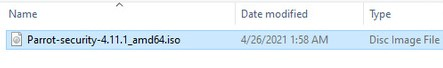
    -  There are two ways to install first by selecting the Live Mode (but every time you turn off the machine , Everything in the machine will be erased) and 2nd by selecting the Install option and both will work the same. we will go with the 2nd method
Select the Parrot OS in Left Pane and click on start for installation.   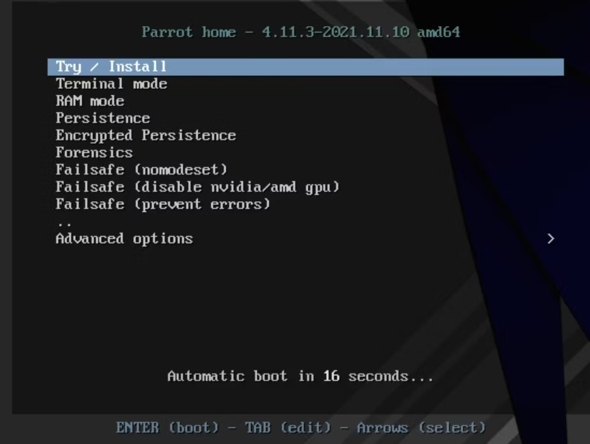
    - In its home screen, Select Install Parrot to begin the installation.   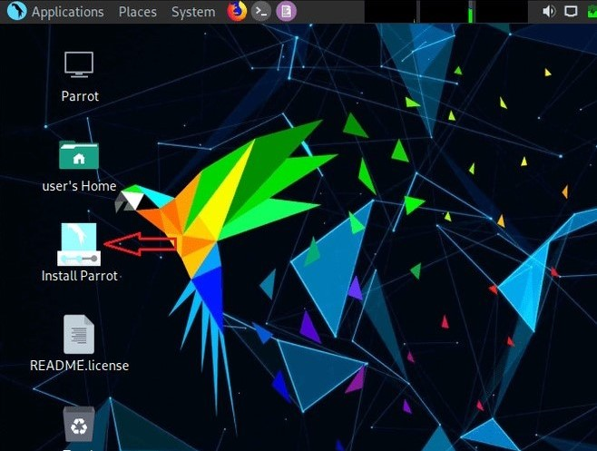
    - Provide your location. Click on Next.   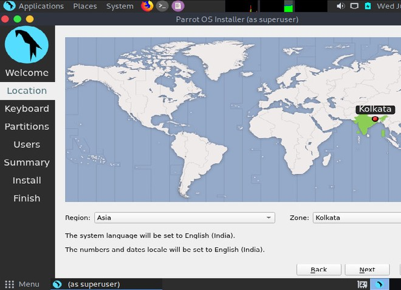
    - Select the default language according to your keyboard below is selected for QUERTY keyboard layout.   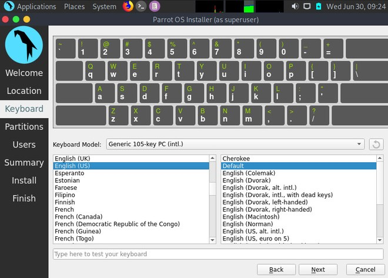
    - Click on the “Erase Disk” radio button (recommended for beginners ). It will automatically partition your virtual disk according to the size you have provided to it. Click on Next.   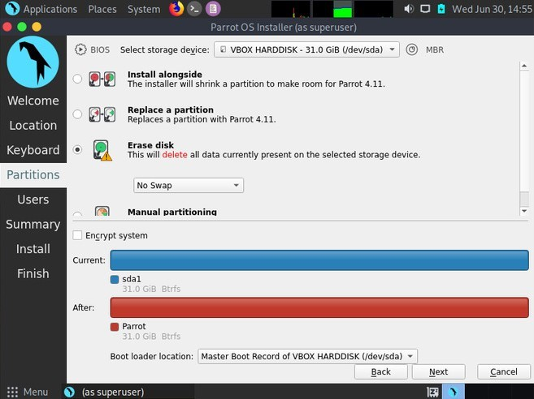
    - Finally, you just need to create a user( root user) and password to access it whenever you want so that your data is saved.   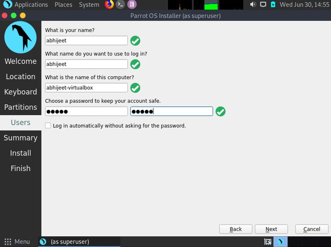
    - On the last page, it will show all the settings that you have selected or done till now so that you can verify it one last time before the final install procedure starts.   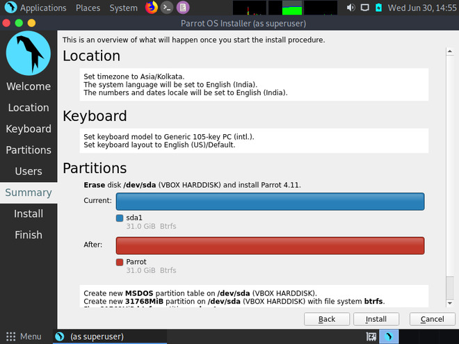
    - After verification, if you are not satisfied and change some settings then you can either click on the Back button or click on the Cancel button. If satisfied, then click on the Install button, it will prompt you to continue installation, then click on Install Now, to begin the installation.   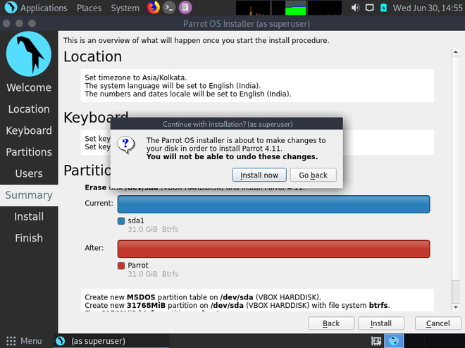
    - Now we just need to wait for at least 20-30 minutes for the installation to finish up. After it has done, it will prompt to restart. Click on it restart so that your virtual machine will save all the necessary changes that have been made.   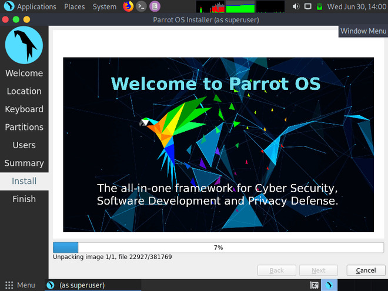
    - After restart you will see that it’s done.   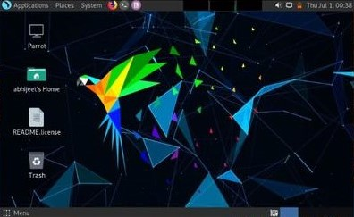
    - #### Now Your Parrot OS is successfully installed in your PC with all the basic functionalities that are required. :D
---

- ## Features of Parrot OS
  ### It is intended for daily Linux users, software developers, system administrators, system programmers, computer science/engineering students.
    + Full office suite.
    + Multimedia production tools including VLC and GIMP.
    + Anonymity tools such as AnonSurf, TOR, and Firefox pre-installed Ad-blockers.
    + Full disk encryption and all encryption tools including zulucrypt, sirikali, and more.
    + Development tools such as VSCodium and Geany, and much more.
    + Support for popular programming languages/frameworks such as Nodejs, Go, Rust, Python, Java, and many other, compilers, interpreters, libraries, and development frameworks either pre-installed or installable from the supported repositories.
    + Parrot OS is completely free and developed by the open-source community, hence, giving users the source code to customize it as per their needs.
    + Parrot OS is very lightweight and runs amazingly well on legacy hardware with a smaller number of resources.
    + Parrot OS receives constant timely updates to keep ahead of the other tools and ensures that it is completely sandboxed at the same time.
    + Parrot is recommended for users who are passionate about customization
        + Custom Kernel: Along with all the giant catalog of scripts, parrot security has its own hardened Linux kernel, modified explicitly to provide as much security and resistance to hackers as possible as the first line of defense.
        + Customizable Desktop: They provide a choice between two different desktop environments, MATE, which comes pre-installed by default, and KDE. You can think of desktop environments as the main UI for a Linux distribution for those unfamiliar with Linux terminology.
    + Variety of Apps: All the tools you find in Kali Linux, a well-known penetration testing operating system, are present in Parrot Security, and then a few extra ones for good measure.

---
- ## Extra Information about parrot!

	* Desktop Environment: By default, Parrot OS uses the `Mate desktop environment`. 
    		+ However, users can install other Desktop Environments.

	* Desktop Diplay Manager: `Lightdm`
	* Package manager: Parrot uses `apt` package manager when we want to download packages or update the workspace 
    	+ apt-get update
    	+ apt-get upgrage
    	+ apt install ....
	* System Requirements:
    + **The minimum system requirements to run a full-fledged installation of parrot security are as below:**
        + No Graphical Acceleration Required
        + Minimum 320MB RAM is required
        + A minimum 1GHZ dual-core CPU is required
        + It can boot in legacy and UEFI modes as well
        + At least 16GB of hard disk space is needed to install the operating system

+ Parrot OS is designed for security, privacy, and development, Parrot ships with an assortment of IT security and digital forensics tools, utilities, and libraries; development and programming tools; as well as privacy protection tools.

- #### Parrot has come a long way since its inception. It has grown into a quintessential framework for Cyber Security operations. It has advanced remarkably thanks to the core team and an active community of contributors.

+ Parrot has different editions for different use cases.
    * Parrot Security Edition
    * Parrot Home Edition
    * Parrot Cloud Edition
    * Parrot Architect & IoT
    * Parrot Raspberry Pi Images

+ The Home edition is recommended for home users looking for privacy and an alternative to Windows.

+ In Parrot OS, several tools dedicated to penetration testing are specifically built for security researchers.
    * TOR
    * AnonSurf
    * OnionShare
    * I2P
    * NMAP
+ User's Opinions and reviews about Parrot OS 
    * "Best open source OS to do penetration for ethical hacking."
    * "An alternative of Kali seems quite light"
    * "This is mainly for security professionals it has in-built all pre-installed tools"
    * "Modern Linux distribution for security professionals"
    * "Stable OS, Friendly, Secure, Continue Update, Support Community"
    * "Good UI plus Security features"
    * "The fastest growing distribution for offensive security and pentesting"
    * "Preferred this over Kali"
    * "Excellent for pen testing. If you use Kali, you'll love Parrot"
    * "The OS for the cyber security professionals"
    * "Best and Suitable Platform for Penetration test"
