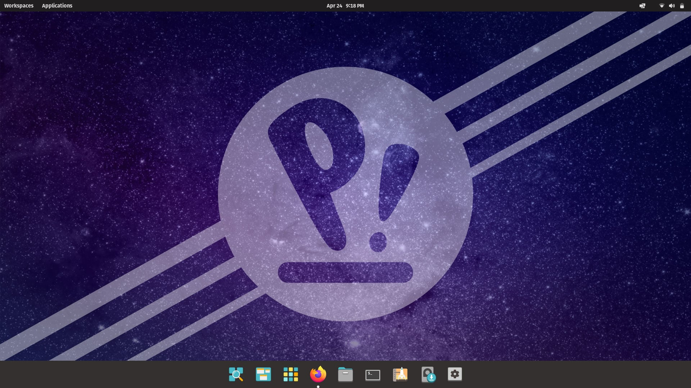

# Pop-Os

## What Pop_Os based on ?

- #### Pop Os based on Ubuntu

---
## Pop_Os History

- #### developed by System76.
- #### System76 is a well-known manufacturer of PC and server hardware that has always chosen to use free software. To save costs and give users freedom.
-  #### Development of Pop!_OS was commenced in 2017.
- #### The first release of Pop!_OS was 17.10, based upon Ubuntu 17.10 .
-  #### The first release was a customized version of Ubuntu GNOME, with mostly visual differences. Some different default applications were supplied and some settings were changed.
---

## Pros
- #### Auto stacking of windows
- #### Keyboard navigation / shortcuts
- #### Productive worksystem
- #### Pop_shop for software managment (nicely organized and categorized )
- #### Separate installation for NVIDIDA GPUs
- #### Gaming ready & hardware (Steam , gamehub , Lutris)
- #### Security and privacy aspects (support full disk encryption)
- #### Easy installation / Easy to use
- #### Automatic updates
- #### Faster than most of the Operating systems (Open source so developers can update its source code)
- #### Auto-Tiling
- #### A lot of development toolkits that works efficently
---
## Cons
- #### only a 64-bit processor is available
- ####  Dependant on ubuntu
- #### Doesn't support dual booting

---
## Who's it made for?
- #### Pop Os is suited for both beginners and intermediate linux users it  more polished and looks more appealing.

---

## How to install Pop_Os
- Frist download virtualBox from [here](https://www.virtualbox.org/).
- and Pop_Os iso from [here](https://pop.system76.com/).

#### 1. Virtualbox Start Screen

- This is the initial screen of VirtualBox after freshly installing on your OS. Click on the "New" button on the top left corner. It should be clearly marked with a colorful blue icon.

#### 2. Create and Name New VM

- Once you click on the new, button you should have the screen where you can name the VM and what kind of operating system. We use Pop!_OS, of course, but you can use whatever you like. Set your type to "Linux" and the version to "Ubuntu (64 bit)". Your screen should look like the screenshot above. Click "Next" button to move to the next screen.

#### 3. Allocate Memory

- Set the memory to 4096 MB. The default value of 1024 MB is not enough to run Ubuntu and you will have problems. You can of course set it to as high as you like. Click "Next" button to the next screen.

#### 4. Choose Drive Type

- Pop!_OS will need at least 15GB but it is recommended to give it 20GB if possible. After adjusting storage, feel free to accept the defaults and click the "Create" button.

#### 5. Choose Disk File Type

- You can accept the default value here as well and click on the "Next" button.

#### 6. Set Drive Allocation Type

- This dialog tells you how you want to grow the disk as you put content on it. The default is the correct answer here as you don't really want to allocate space that you will not actually use. Click on the "Next" button to the next screen.

#### 7. Name Drive File and Confirm Size

- Feel free to just pick the defaults here and click on the "Create" button.

#### 8. Enable EFI Mode

- To ensure the bootloader installs properly:

   
   
    1. Open the settings for the machine (click the machine on the list and press <kbd>Ctrl</kbd> + <kbd>S</kbd>)

    2. Click **System** in the list
  
    3. Check the Enable **EFI (special OSes only)** checkbox
  
    4. Click the **OK** button
   
     

- The install may fail if you use VirtualBox's default legacy boot mode.

#### 9. Start VM

- You should be all ready to run! Hit the **"Start"** button, the green arrow on the toolbar at the top.

#### 10. Open ISO File

- In order to run, it needs a startup disk, in this case the Pop!_OS iso file that you downloaded and probably in your Downloads directory. Using the above dialog, click on the little icon with the folder and the green up arrow.

- Go to your Downloads area and select the ISO image you downloaded and click **"Open"**.

#### 11. Start Pop!_OS VM

- Click on the Start button on the toolbar. It is the icon with the green arrow.

#### **That's it! You're done!**

---
