# Ubuntu

- ## What's it based on ?
    Ubuntu is based on Debian.

- ## History of it 
    - ### Brief Description
        Ubuntu is one of the most popular and widely used Linux distributions in 
        the  world, thanks to its user-friendliness, elegant and simple UI, and a
        large online community that provides support and solutions to common user
        problems. As a result, over the years, Ubuntu has become one of the most 
        recommended Linux distributions for beginners.

    - ### What's it based on ? (Story)
        The source code that makes up the Ubuntu Linux distribution originates 
        from another, much older Linux distribution known as Debian. Debian is 
        still a widely respected operating system but came under criticism for 
        infrequent updates and less than user friendly installation and 
        maintenance.

        A South African internet mogul decided it was time for a more user 
        friendly Linux. He took the Debian distribution and worked to make it a
        more human friendly distribution which he called Ubuntu. He subsequently
        formed a company called Canonical Ltd to promote and provide support for
        Ubuntu Linux. In addition Shuttleworth has formed and funded a foundation
        to guarantee the future of Ubuntu.

    - ### Ubuntu meaning
        Ubuntu Linux derives its name from ‘Ubuntu’, a South African word that
        means ‘I am because you are’. This is a translation to mean that we become
        who we are through other people and denotes the spirit of togetherness.

    The rest, as they say, is history. Ubuntu has since gone from strength to 
    strength. Dell and other hardware vendors now ship computers pre-loaded with 
    Ubuntu Linux and Ubuntu usually <strong> tops </strong> the chart at 
    DistroWatch.com (a web site which tracks the popularity of the various Linux
    distributions).

    If you are new to Linux, or already use Linux and want to try a different 
    Linux distro it is unlikely you will find a better option than Ubuntu Linux.

- ## Pros & Cons of Ubuntu
    Ubuntu is a popular Linux-based operating system that has gained a significant
    following due to its user-friendly interface and open-source nature. Here are
    some of the pros and cons of using Ubuntu:

    - ### Pros:

        - Free and open-source: Ubuntu is free to download and use, and its source code is freely available for anyone to modify and redistribute.

        - User-friendly interface: Ubuntu has a simple and easy-to-use interface that makes it accessible for beginners.
        - Wide range of applications: Ubuntu has a large collection of software available in its software center, including many popular applications such as Firefox, LibreOffice, and GIMP.

        - High security: Ubuntu is known for its robust security features, including its AppArmor security framework and built-in firewall.

        - Strong community support: Ubuntu has a large and active community of developers and users who contribute to the operating system and provide support to new users.
    - ### Cons:

        - Limited compatibility with some software and hardware: While Ubuntu supports a wide range of hardware and software, there may be some older or specialized devices that are not fully compatible with Ubuntu.
        
        - Less support for gaming: Although Ubuntu has made strides in supporting gaming, it still lags behind Windows in terms of game support.

        - Learning curve for advanced users: While Ubuntu is user-friendly, it may take some time for advanced users to get used to the command-line interface and other advanced features.

        - Potential for instability: As with any operating system, there is a potential for instability or crashes, particularly when using third-party software or when updating the system.

        - Limited commercial software support: While Ubuntu has a large collection of open-source software, it may be more challenging to find commercial software that supports Ubuntu, particularly in certain industries.

- ## Who's it For? & Who's it Not For?
    - #### I have always recommended Ubuntu to new Linux users because it has all the software most will need for general computer use. Also it seems to have the most documentation online when running into issues.

    - #### Ubuntu is a great system, as are all Linux distros. It just depends on what you are looking for. Need something super light weight for a old garbage laptop?... Puppy Linux. Something that has your cybersecurity wants/needs pre installed?.... Kali or Parrot. A Linux distro to get you started?.... Ubuntu or Mint

    - #### when it comes to ease of use and beginner-friendliness, Ubuntu is the name that pops up the most. Why is this so? And why do people recommend Ubuntu as the first distro to Linux beginners? Let's find out.

    - ## Ubuntu is good for whom?
        + Amateur users with little to no Linux experience
            * it's easy to set up and use.
            * User-Friendly: It's a wonderful Linux distribution to start with—and if  you're pleased with it.

        + Ubuntu is a Linux distro based on Debian. It is suitable for cloud computing, servers, desktops, and internet of things (IoT) devices. 

        + It's much used in servers especially web servers

        + It is really helpful and good for the users who 
            * Improve the speed of communication through distributed computing.
            * work in Robotics field
            * are in University education
            * work in Software development

        + Ubuntu has proven to be the best option for Developers. This is because it supports new technology like Artificial Intelligence and Machine learning.

            * Ubuntu is known to be a preferred choice for programmers. This is mainly because it is an Open source Operating system, and this allows the programmers to deeply understand the working of this operating system.

            * The terminal can be used for all kinds of programming and no third-party application is needed as in the case with Windows.

        + Yes. It's good For writing, Net surfing, email, pic, sound and video editing it’s as good as anything out there. 

        + Perfect for users with newer hardware and desktop needs

        + It is available free of cost for both personal and professional use.

        + When Ubuntu Operating System needs to be updated, the users do not need to restart the machine as the updates can easily run in the background. This in turn makes Ubuntu a preferred choice for services like Server.

        + Although it was designed primarily for personal computers, you may also use it on servers. GNOME, a graphical user interface and suite of desktop apps for Linux, is used in the standard version of Ubuntu. GNOME is designed to be comparable to the Windows desktop experience to make Linux easier for non-programmers.

        + Ubuntu is available in three different editions such as Desktop, Core, and Server versions. The Core edition is for IoT devices and robots. The developer of Ubuntu is Canonical and the founder, Mark Shuttleworth, might have never imagined the popularity Ubuntu gets now. 

        + Boost the old devices can be laptops and desktops.

        + What does a typical computer user want from a desktop (or laptop) operating system? They want a reliable, easy to maintain, easy to understand, simple to use operating system that makes it easy for them to access the small number of apps that they use on a regular basis. Ubuntu is that operating system. For such people, Ubuntu is brilliant. In terms of reliability and each of use, it is, I suggest, light years ahead of any version of Windows.
            * In Linux terms, lots of people use Ubuntu. Most people who use Ubuntu probably love it. They probably think it's wonderful. It is a great operating system for a typical computer user.

        + Users who are passionate about security
            * Ubuntu gets a new release every six months, and Long-Term Support (LTS) releases in every two years. Canonical gives security updates and support with each Ubuntu release.

            * Corporate Backing: Canonical is in charge of releasing six-monthly landmark releases and periodic LTS releases for enterprise business usage, as well as security patches, support, and the overall online architecture for community involvement. Canonical is trusted by businesses to maintain, protect, and manage Ubuntu systems and devices.

        + I use Ubuntu in the server space. It’s reliable and well supported.

    - ## Ubuntu is not good for whom?

        - Defnitely Ubuntu is not suitable for everyone 
        + Microsoft Visual Studio, Microsoft Excel, Adobe and even Notepad++ are not available on Ubuntu.

        - Designers that use photoshop or any adobe programs daily , but definitely It has alternatives you can use them on Ubuntu.

        - People Who use MS programs daily and essential for them

        - drawback with Ubuntu is that the support for some of the hardware components and software applications does not match the standard provided by Windows

        - #### Ubuntu also does not support some of the popular software like Photoshop or MS office

        - Users that update their system constantly and download alot of things daily
        + Package managers, “sudo apt update”. It’s only a matter of time until your package manager get corrupted, and then since you can’t install or uninstall anything, you’ll need to reinstall Ubuntu.

        - Gnome Linux (Ubuntu) currently doesn’t work well with QT5 GUI apps. That’s why many apps, such as Zoom, get stuck and are unusable.
        * Lack of GUI suppport. Gnome Linux (Ubuntu) currently doesn’t work well with QT5 GUI apps. That’s why many apps, such as Zoom, get stuck and are unusable

        - users who respect privacy 
        + By installing users agree to allow Ubuntu's parent company Canonical to collect user search data and IP addresses and to disclose this information to third parties including Facebook, Twitter, BBC and Amazon.

- ## How to install Ubuntu
    - Download the Ubuntu image, from [here](https://ubuntu.com/download/desktop), then it will be like this : 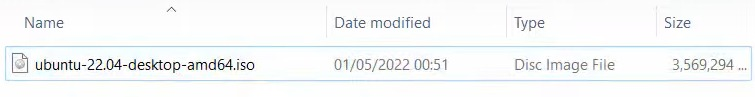
    - in the beggining this window will appear, just press enter on the first choice
        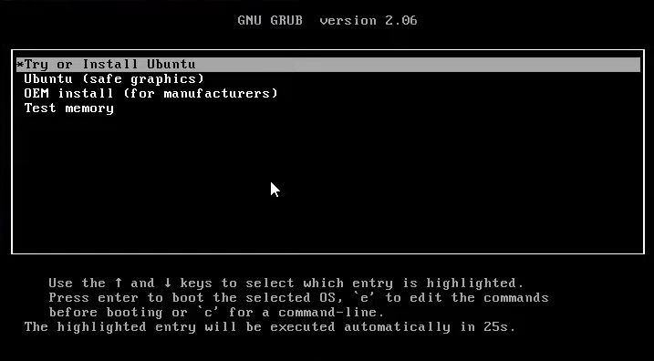
    - and loading ...
       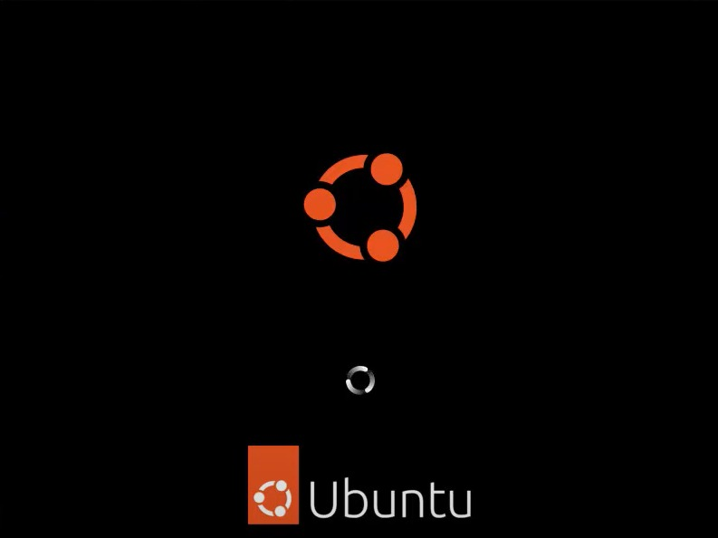
    - click (Install Ubuntu) here : 
       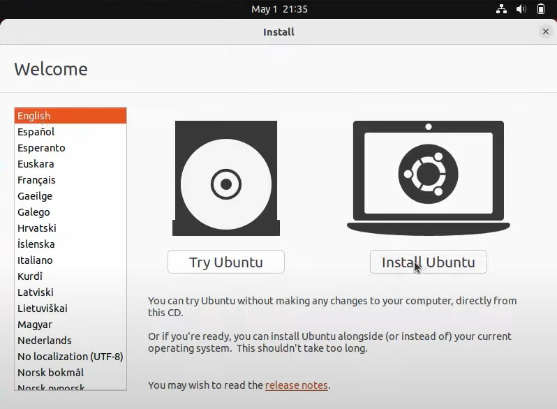
    - here you can choose any language you want then click (Continue) 
       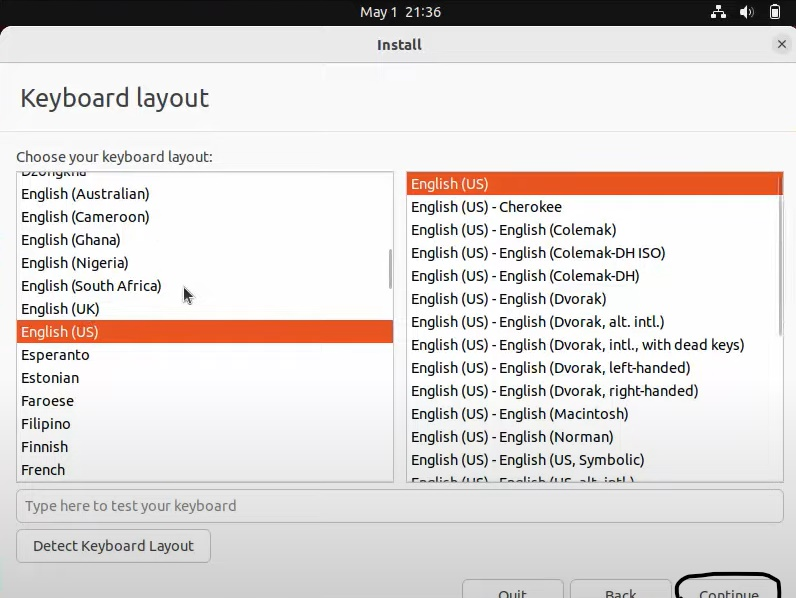
    - here check if this is selected and press (Continue)
       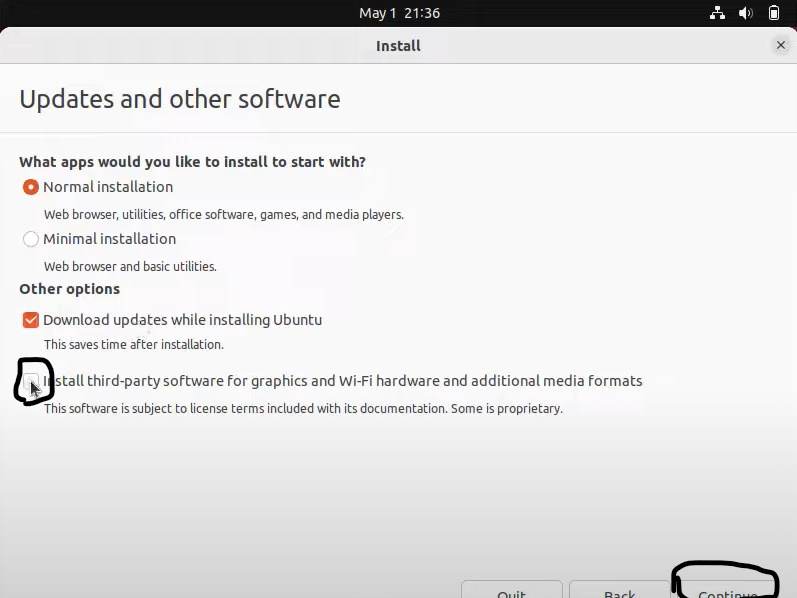
    - and then click (Install Now) 
       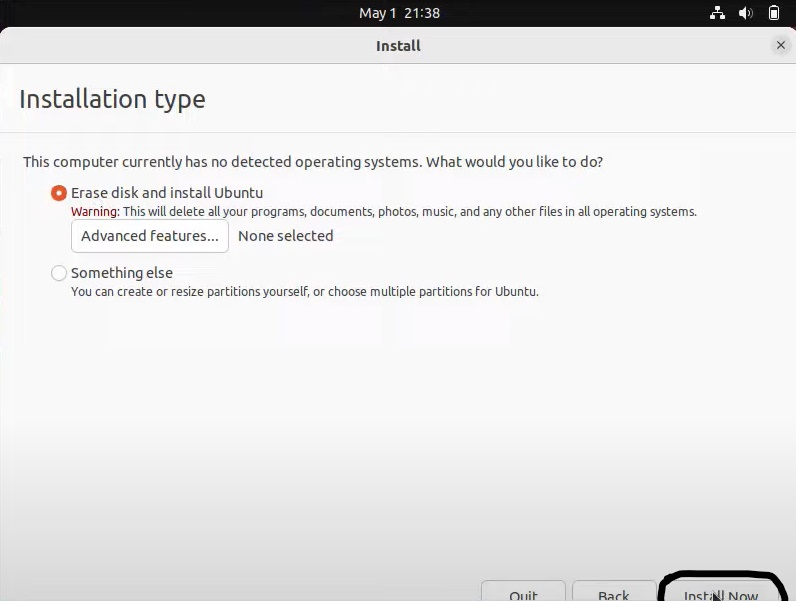
    - choose you location here and click (Continue) 
       
    - fill you data (name, pc's name, username, password, confirm that password), then click (Continue) 
       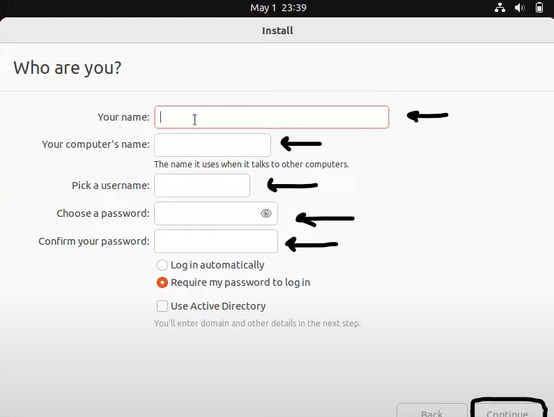
    - wait for it a little 
       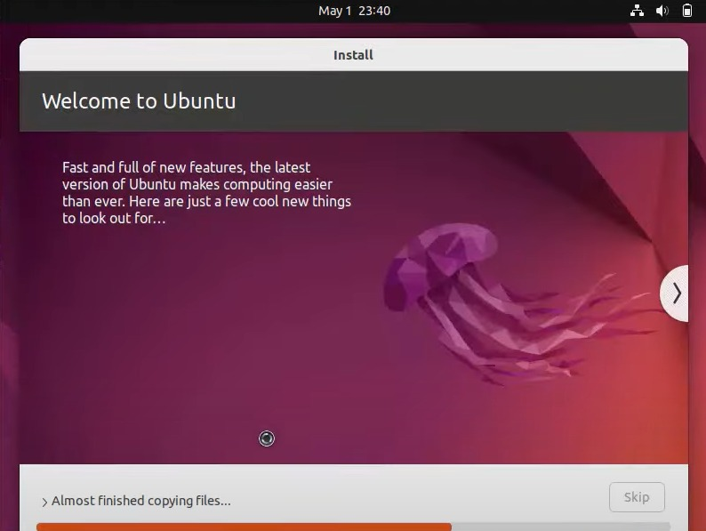
    - click (Restart Now) and it will restart 
       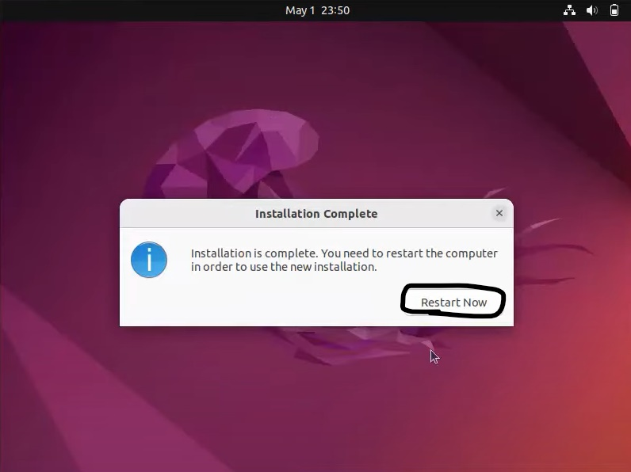
    - after testart this window will appear, you can connect any of your accounts, but if you don't want to do that just click (Skip) 
       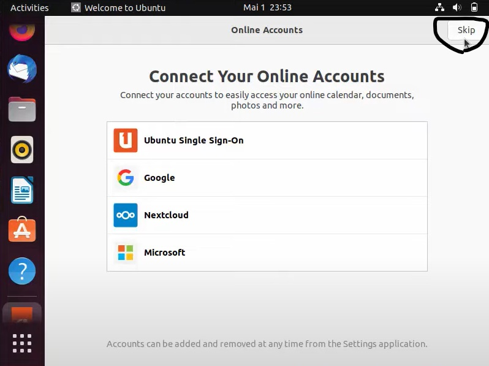
    - click (Next) 
       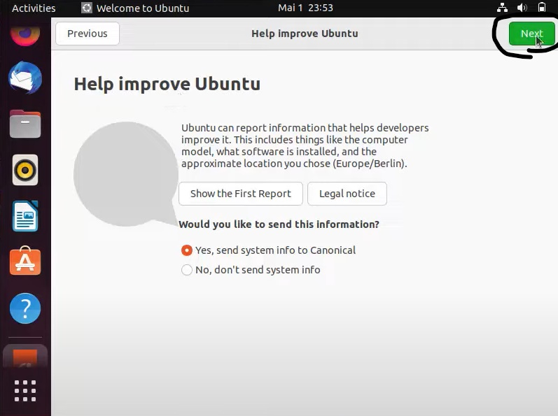
    - click (Next) again 
       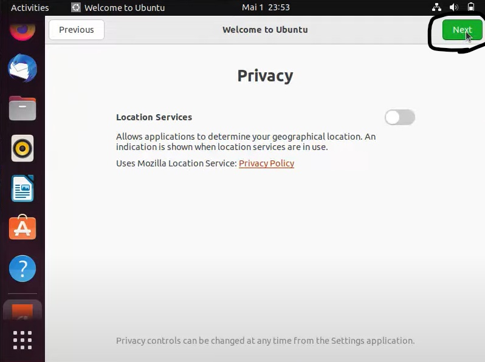
    - then click (Done) 
       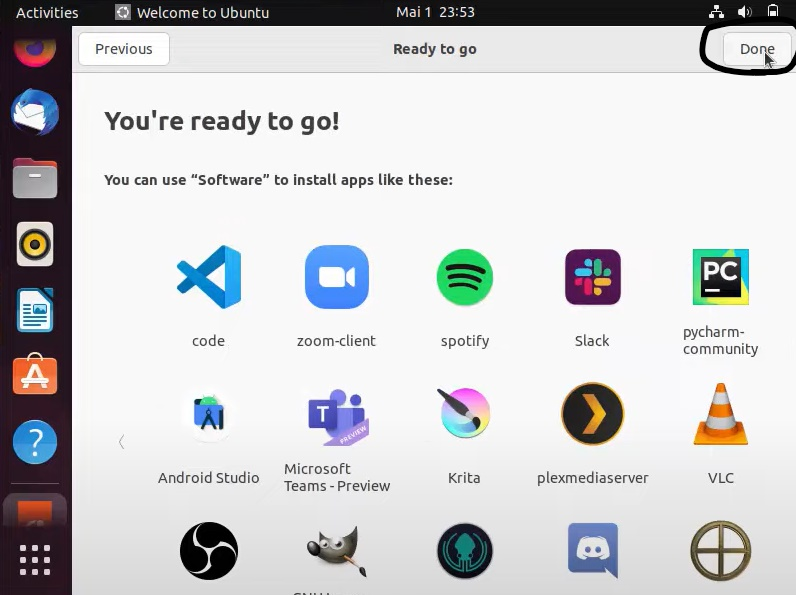
    - and here you go! :D 
       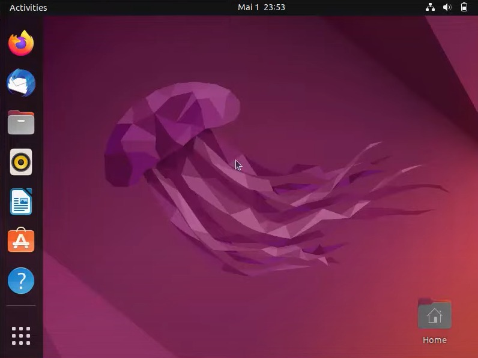
- ## Features of Ubuntu
    Following are some of the significant features of Ubuntu :

    - The desktop version of Ubuntu supports all the normal software on Windows such as Firefox, Chrome, VLC, etc.

    - It supports the office suite called LibreOffice.

    - Ubuntu has an in-built email software called Thunderbird, which gives the user access to email such as Exchange, Gmail, Hotmail, etc.

    - There are a host of free applications for users to view and edit photos.

    - There are also applications to manage videos and it also allows the users to share videos.

    - It is easy to find content on Ubuntu with the smart searching facility.

    - The best feature is, it is a free operating system and is backed by a huge open source community.

